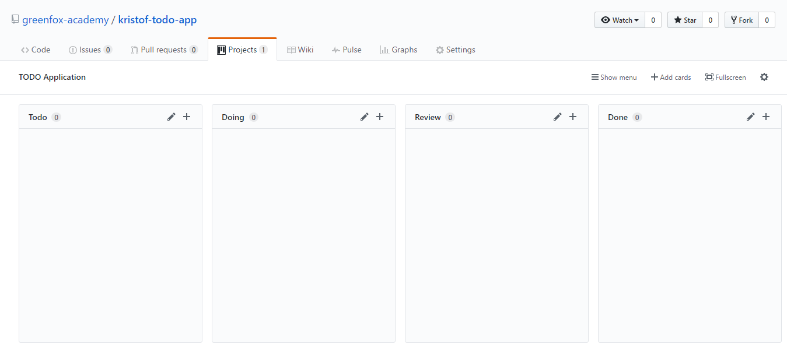

# Project: TODO Application

> Write a command-line todo application to easily keep track of your day-to-day
> tasks. This is **a complex exercise**, so please read through the whole first,
> then start at the beginning.

## Materials & Resources

| Material                                                                  | Time |
| :------------------------------------------------------------------------ | ---: |
| [Using the Gherkin Language](https://www.youtube.com/watch?v=KP0vpVLatMc) | 5:44 |

## Material Review

- What's the Gherkin language?
- What are command line arguments?

## Tasks

### Basics (mandatory)

- [Print usage](#print-usage)
- [List tasks](#list-tasks)
  - A todo task has (at least) a completed state and a description
- [Empty list](#empty-list)
- [Add new task](#add-new-task)
- [Check task](#check-task)
- [Remove task](#remove-task)
- [Argument error handling](#argument-error-handling)

### Advanced (optional)

- [Add new task error handling](#add-new-task-error-handling)
- [Remove task error handling](#remove-task-error-handling)
- [Check task error handling](#check-task-error-handling)
- Write unit tests for any unit it feels possible
- Refactor the application to align with the proposed architecture
- Anything else that comes to your mind
  - longhand commands
  - list only undone tasks with `-l` and all tasks with `-la`
  - add/remove/check more items with one command
  - Multiple users


## Project setup

### Installing dependencies
  - We have to access the command line arguments, for that we need access to the `ts-node process`.


  - Since we can not reach is without packages, we have to install some of them with package management tools like [npm](https://www.npmjs.com).

  - How can I check if npm is already installed?

  If you type `npm -v` in your terminal/shell, and it is printing some version number like `6.10.1`, then you can jump to the package adding part, if not, you have to install it. [installing instuctions](https://docs.npmjs.com/downloading-and-installing-node-js-and-npm)

  - Installing the package we need.

  All you have to do to write the following command into your terminal: 
  `npm i`.
  
  It will create and download some stuff in the folder called `node_modules`. Don't worry it is the normal behaviour, and we will not push the folder content since it is in the `.gitignore` file.

### Accessing the command line arguments

  - Let's create a typescript file with the following content (we will name it `args.ts` for the sake of the example):

  ```typescript
  'use strict';

  console.log(process.argv);

  ```

  If you run this file from the command line:

  `ts-node args.ts`

  it will print something like this: 
  ```bash
    [ '/usr/local/bin/ts-node', '/Users/markkovari/Dev/args/args.ts' ]
  ```
  so basically if we are not writing any other thing after the ts-node command it will still has two elelement: 
   - the path of your (ts)node environment,
   - the path of the file you are running
  
  But when we are giving another arguments like `ts-node args.ts argument1 argument2`, it will print the following output when you run it:

  ```bash
  [
    '/usr/local/bin/ts-node',
    '/Users/markkovari/Dev/args/args.ts',
    'argument1',
    'argument2'
  ]
  ```

### Hints

 - The output of the following code is `true`:

  ```typescript
      'use strict';

      console.log(Array.isArray(process.argv));
  ```
   and the result of the following is `string` if you have an added argument in the command line:

  ```typescript
   'use strict';


    console.log(typeof process.argv[2]);
  ```

## Stories

> To follow the state of our projects and manage our work, we use so-called
> Kanban Boards. They usually contain our tasks separated in columns. (todo,
> doing, review, done)

Create a Kanban Board for yourself and add the stories that need to be done.
Later on, update your board so you can always see your project's state and your
next steps.

### How to create your Kanban Board and where to work?

- Fork this repository. 
- You will develop your todo application in this forked repository. In other words you
  will push to your forked repository.
- **We already have a `.gitignore` file with node_modules in it.**
- In the Projects view, create a new project called *TODO
  Application*
- Then create your board. It should consist the following columns
  - Todo
  - Doing
  - Review
  - Done
- Add the stories to your board

It should look something like this. (obviously yours should have the stories
added)



You should not have more than 2 stories in the doing phase. If you already have
a few stories in the review phase show them to a mentor.

### Print usage

- **Given** the terminal opened in the project directory
- **When** the application is ran without any arguments
- **Then** it should print the usage information

```text
$ todo

Command Line Todo application
=============================

Command line arguments:
    -l   Lists all the tasks
    -a   Adds a new task
    -r   Removes an task
    -c   Completes an task
```

### List tasks

- **Given** the terminal opened in the project directory
- And the file where you store your data
- And a task with the description `Walk the dog` stored in the file
- And a task with the description `Buy milk` stored in the file
- And a task with the description `Do homework` stored in the file
- **When** the application is ran with `-l` argument
- **Then** it should print the tasks that are stored in the file
- And it should add numbers before each

```text
$ todo -l

1 - Walk the dog
2 - Buy milk
3 - Do homework
```

### Empty list

- **Given** the terminal opened in the project directory
- And the file where you store your data
- And the file has 0 task
- **When** the application is ran with `-l` argument
- **Then** it should show a message like this: `No todos for today! :)`

### Add new task

- **Given** the terminal opened in the project directory
- **When** the application is ran with the `-a "Feed the monkey"` argument
- **Then** it should add a new task with the description *Feed the monkey*

### Add new task error handling

- **Given** the terminal opened in the project directory
- **When** the application is ran with the `-a` argument
- **Then** it should show an error message like:
  `Unable to add: no task provided`

### Remove task

- **Given** the terminal opened in the project directory
- And the file where you store your data
- And the file has at least 2 tasks
- **When** the application is ran with the `-r 2` argument
- **Then** it should remove the second task from the file

### Remove task error handling

1. - **Given** the terminal opened in the project directory
   - **When** the application is ran with the `-r` argument
   - **Then** it should show an error message like: `Unable to remove: no index provided`

2. - **Given** the terminal opened in the project directory
   - And the file where you store your data
   - And the file has less than 20 tasks
   - **When** the application is ran with the `-r 20` argument
   - **Then** it should show an error message like: `Unable to remove: index is out of bound`   
3. - **Given** the terminal opened in the project directory
   - **When** the application is ran with the `-r apple` argument
   - **Then** it should show an error message like: `Unable to remove: index is not a number`

### Argument error handling

- **Given** the terminal opened in the project directory
- **When** the application is ran with an unsupported argument *(eg. `get`)*
- **Then** it should show an error message like: `Unsupported argument`
- And it should print the usage information

### Check task

- **Given** the terminal opened in the project directory
- And the file where you store your data
- And the file has at least 2 tasks
- **When** the application is ran with the `-c 2` argument
- **Then** it should check the second task from the file

### Print all tasks

- **Given** the terminal opened in the project directory
- And a undone task with the description `Walk the dog` stored in the file
- And a done task with the description `Buy milk` stored in the file
- And a undone task with the description `Do homework` stored in the file
- **When** the application is ran with `-l` argument
- **Then** it should print the tasks that are stored in the file
- And it should add `[ ]` before each if its undone otherwise `[x]`

```text
1 - [ ] Walk the dog
2 - [x] Buy milk
3 - [ ] Do homework
```

### Check task error handling

#### Missing Index

- **Given** the terminal opened in the project directory
- **When** the application is ran with the `-c` argument
- **Then** it should show an error message like:
  `Unable to check: no index provided`

#### Index is not found

- **Given** the terminal opened in the project directory
- And the file where you store your data
- And the file has less than 20 tasks
- **When** the application is ran with the `-c 20` argument
- **Then** it should show an error message like:
  `Unable to check: index is out of bound`

### Invalid argument type

- **Given** the terminal opened in the project directory
- **When** the application is ran with the `-c apple` argument
- **Then** it should show an error message like:
  `Unable to check: index is not a number`
